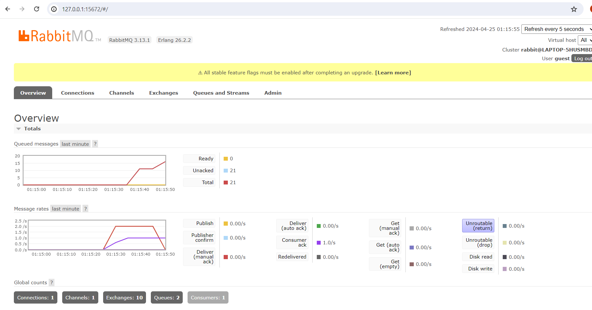

### Understanding subscriber and message broker

#### a. what is amqp?
In this code amqp refers to Advanced Message Queuing Protocol. It is an open standard protocol for message-oriented middleware that allow different applications to communicate with each other. It provides a reliable way to handle asynchronous communication between systems.

#### b. what does it mean? This part of the code guest:guest@localhost:5672 , what is the first guest, and what is the second guest, and what is localhost:5672 is for?
The part "guest:guest@localhost:5672" shows the  details for the connection to the AMQP broker (message broker).

The first guest is the username to authenticate with the AMQP broker. In this case, it is using the default username "guest". The second guest is the password associated with the username. Here, it is using the default password "guest". The substring "localhost" refers to the hostname where the AMQP broker is running. In this case, this means the broker should be running on the same machine as the application. The ":5672" after "localhost" shows the default port number that should be used by AMQP protocol. It specifies the port on which the AMQP broker is listening for connections. 

We can see 21 queued messages in the screenshoot. Remember the "thread::sleep(ten_millis);" line that we have in the code of subscriber program. This line is enough to simulate a slow subscriber. And having a slow subscriber combined with running the publisher repeatedly and having the publisher send messages at a higher rate than the (now slow) subscriber program can handle, means that there is going to be a backlog of messages in the queue. The message queue serves as a buffer to make sure that message delivery is reliable and message loss is prevented.